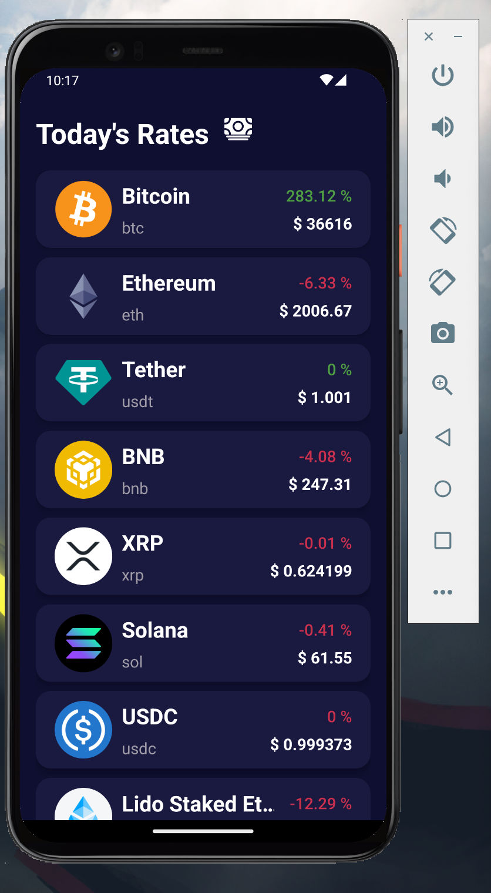
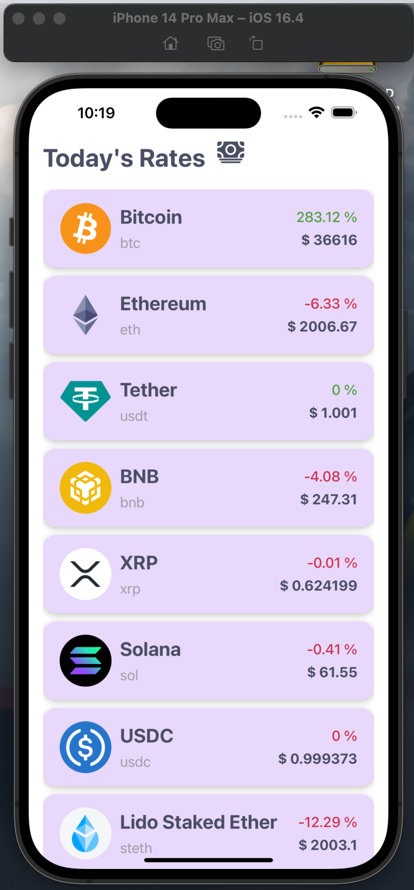
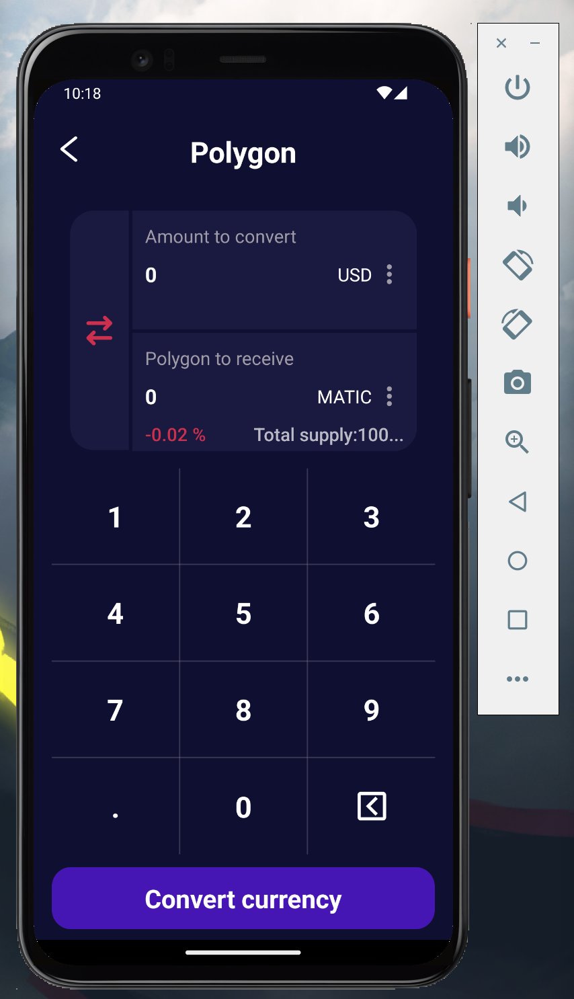
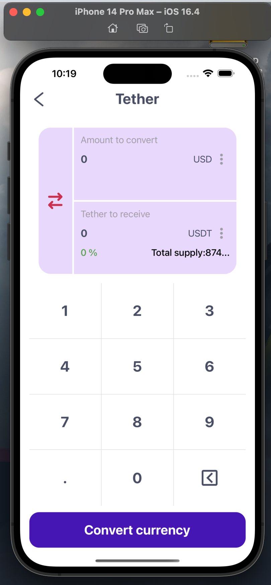
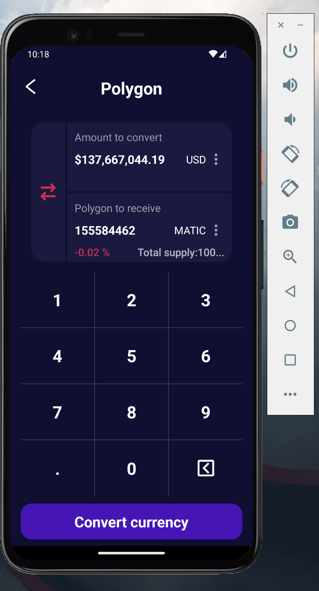
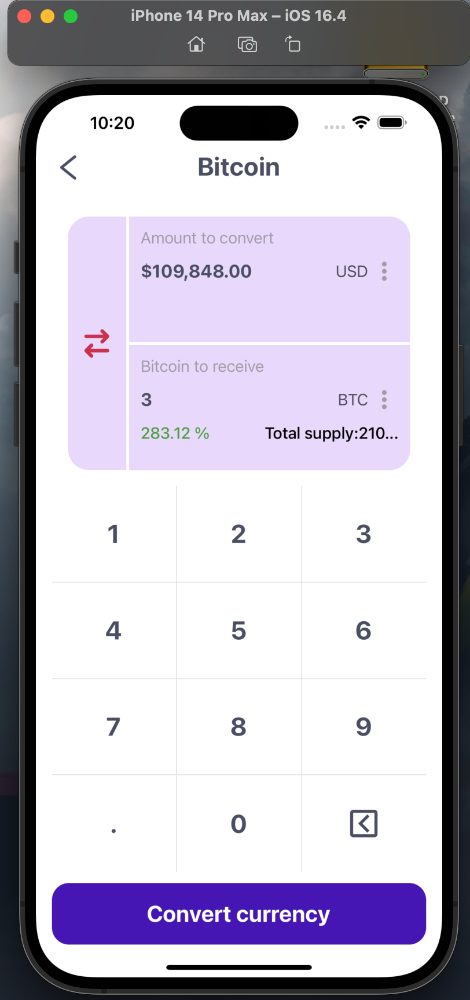

# PlurizaTechnicalTestRN App

This is a React Native application to display information about cryptocurrencies and their value in dollars. Data is obtained from [public s3 bucket API](https://pluriza.s3.us-east-1.amazonaws.com/response.json).

### Setup Environment

Project created with React Native CLI.[ See official docs](https://reactnative.dev/docs/environment-setup) to set up the environment.

### Run

**Install dependencies**

```
yarn
```

**Install IOS Pods**
cd ios to navigate to the ios folder.
```
 install Bundler
bundle exec pod install
```
 to install the iOS dependencies managed by CocoaPods.
**Run IOS**

Remember to have an iPhone 14 Pro Max in the emulator or alternatively delete the line of code in package.json

```
yarn ios
```

**Run Android**

```
yarn android
```

**Build Detox(test end 2 end)**

```
yarn android-e2e-build
```
```
yarn ios-e2e-build
```

**Run Detox(test end 2 end)**

```
yarn android-e2e-test
```
```
yarn ios-e2e-test
```

### 🛠 Tech and Libraries

- [React Native](https://reactnative.dev/)
- [TypeScript](https://www.typescriptlang.org/)
- [React Navigation](https://reactnavigation.org/): Routing and navigation
- [Redux Toolkit](https://redux-toolkit.js.org/Í): Data storage efficient Redux
- [Axios](https://github.com/axios/axios): Promise based HTTP client
- [Detox](https://wix.github.io/Detox/): Gray box end-to-end testing and automation framework for React Native apps

### App Screenshots

|                 |                   Android                    |                   IOS                    |
| :-------------: | :------------------------------------------: | :--------------------------------------: |
|   Home Screen   |      |      |
| Details Screen  |      |      |
| Details Results |      |      |

# Link-video-demo-app with Detox e2e
[](https://www.youtube.com/watch?v=_NfrFiaIbNM)
